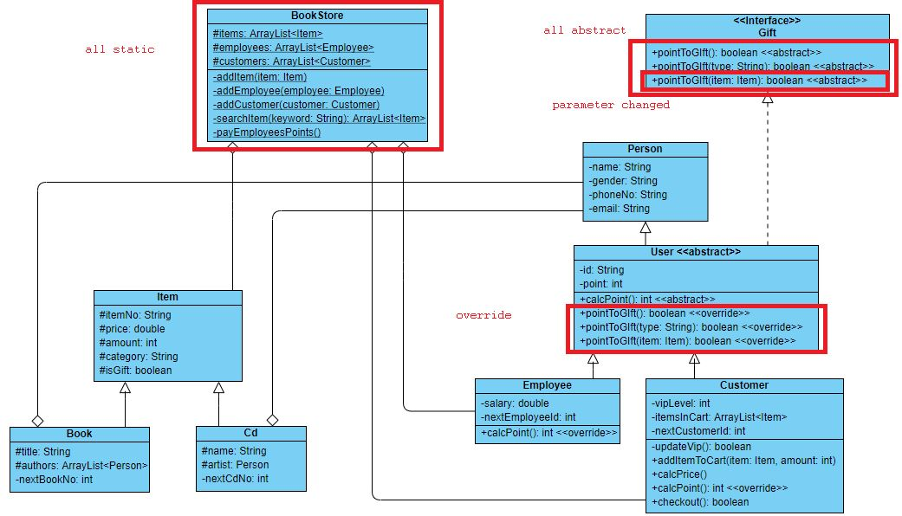

# P2 - Project01 (Midterm)

## **Due Date:** 

Mar-31 23:57:59. **Late submission will directly be marked as 0**.

## **Submission:**

**Please submit .java files**.

**Full Score**: 100

## **Knowledge Points**  of  This  Assignment

1. Inheritance, Polymorphism
2. Abstract method, abstract class
3. Interface
4. UML Class Diagram

***
A bookstore is about to open, and it requires a system to support its business. The good news is that, somehow, the owner knows a friend that knows how to draw a Class Diagram so, at least, the programmer (i.e.: you) doesn't need to directly talk to the owner.

Fig. 1: Class Diagram

 

The bookstore requires a system with two hierarchies. (1) for the item, and (2) for the person.

***
## 1 **Item Hierarchy**

### 1.1 **Item Class**

#### 1.1.1 **Data members**
1. `String itemNo`: the number of the item
3. `double price`: the price of the item
4. `int amount`: the amount of the item in the store
5. `String category`: the category of the item
5. `boolean isGift`: if that item can be used as a gift or not

#### 1.1.2 **Methods**
1. Default constructor
2. Constructor with `itemNo`, `price`, `amount`, `category`, `isGift`
3. Copy constructor
4. `equals()` and `hashCode()`
    * only consider `category` and `price`
5. `toString()`: **All** `toString()` methods should have the format like a table (like what we have in the class).
6. Getters and setters

 

### 1.2 **Book Class**

#### 1.2.1 **Data members**
1. `String title`: the title of the book
2. `ArrayList<Person> authors`: the authors of the book

#### 1.2.2 **Static variables**
1. `int nextBookNo`: the `itemNo` of the next book

#### 1.2.3 **Methods**
1. Default constructor
    * set the `itemNo` as this pattern `B0001` (uppercase letter 'B' followed by a 4 digits number)
    * the `itemNo` should increase by one every time a book is created. 
2. Constructor with `title`, `authors` and the inherited data members
    * set the `itemNo` as this pattern `B0001` (uppercase letter 'B' followed by a 4 digits number)
3. Copy constructor
4. `equals()` and `hashCode()`
    * consider all data members defined in the `Book` class, and `category` and `price` from the `Item` class
5. `toString()`
6. Getters and setters

 

### 1.3 **Cd Class**

#### 1.3.1 **Data members**
1. `String name`: the name of the CD
2. `Person artist`: the artist of the CD

#### 1.3.2 **Static variables**
1. `int nextCdNo`: the `itemNo` of the next CD

#### 1.3.3 **Methods**
1. Default constructor
    * set the `itemNo` as this pattern `C0001` (uppercase letter 'C' followed by a 4 digits number)
2. Constructor with `name`, `artist`, and the inherited data members
    * set the `itemNo` as this pattern `C0001` (uppercase letter 'C' followed by a 4 digits number)
3. Copy constructor
4. `equals()` and `hashCode()`
    * consider all data members defined in the `Book` class and `category` and `price` from the `Item` class
5. `toString()`
6. Getters and setters

***

## 2 **Person Hierarchy**
Anything related to users goes to this class. It contains a general `Person` class, a `User` class, and more specifically, two kinds of Users: (1) `Employee` and (2) `Customer`

### 2.1 **Person class**

#### 2.1.1 **Data members**
1. `String name`: the name of the person
2. `String gender`: the gender of the person
3. `String phoneNo`: the phone number of the person
4. `String email`: the email of the person

#### 2.1.2 **Methods**
1. Default constructor
2. Constructor with `name`, `gender`, `phoneNo` and `email`
3. Copy constructor
4. `equals()` and `hashCode()`
    * consider all data members
5. `toString()`
6. Getters and setters

 

### 2.2 **User class**

#### 2.2.1 **Data members**
2. `String id`: the id of the user
4. `int point`: the amount of points of the user
    * points can be exchanged for gifts and accumulated through purchases (for customers) or salary (for employees)

#### 2.2.2 **Methods**
1. Default constructor
2. Constructor with `id`, and inherited data members
3. Copy constructor
4. `calcPoint()` method: an abstract method to calculate points for a user
5. `equals()` and `hashCode()`
    * consider all data members
6. `toString()`
7. Getters and setters
8. Interface methods

 

### 2.3 **Employee class**

#### 2.3.1 **Data members**
1. `double salary`: the salary of the employee

#### 2.3.2 **Static variables**
1. `int nextEmployeeId`: the ID of the next employee

#### 2.3.3 **Methods**
1. Default constructor
    * set the `id` as this pattern `E0001` (uppercase letter 'E' followed by a 4 digits number)
2. Constructor with `salary` and inherited data members
    * set the `id` as this pattern `E0001` (uppercase letter 'E' followed by a 4 digits number)
3. Copy constructor
4. `calcPoint` method: 
    * Every time an employee gets payed, an amount of points (`1%` of their salary) gets added to their total amount of points
5. `equals()` and `hashCode()`
    * with all data members
6. `toString()`
7. Getters and setters

 

### 2.4 **Customer class**

#### 2.4.1 **Data members**
1. `int vipLevel`: the VIP level of the customer
    * `0`: Normal customer
    * `1`: Regular VIP
    * `2`: Golden VIP
    * `3`: Diamond VIP
2. `ArrayList<Item> itemsInCart`: items the customer has added to its cart (items they plan on buying)

#### 2.4.2 **Static variables**
1. `int nextCustomerId`: the ID of the next customer

#### 2.4.3 **Methods**
1. Default constructor
   
    * set the `id` as this pattern `U0001` (uppercase letter 'U' followed by a 4 digits number)
    
2. Constructor with `vipLevel` and inherited data members
   
    * set the `id` as this pattern `U0001` (uppercase letter 'U' followed by a 4 digits number)
    
3. Copy constructor

4. `updateVip` method: to update the VIP level of a customer. The cost (number of points) to update depends on the current VIP level of the customer:

    1. `0 -> 1`: `50` points
    2. `1 -> 2`: `100` points
    3. `2 -> 3`: `150` points

    * if the customer has enough point to update its VIP level, then modify its `vipLevel` and `point` and return `true`; if the customer does not have enough point to update its VIP level, leave its `vipLevel` and `point` unchanged and return `false`.

5. `addItemToCart` method: the customer can use this method to add an item to its cart. You should deep copy that item and modify the amount it. 
   
* For example, if a Book "Advanced Java" has 50 copies (`amount` is 50), and the customer want to buy 2 copies, you should deep copy the "Advanced Java" book and modify its copies (its `amount`) as 2, so there are still 50 copies of the book in the store, and the customer adds 2 copies to the cart.  
  
6. `calcPrice` method: to calculate the total price of all items in a customer's cart

7. `calcPoint` method: to calculate the amount of points a customer gains after a shopping session

    * If the customer is not a VIP, then each dollar spent gains `1` point, ignore the decimal part
    * If the customer is Regular VIP, `5%` additional point gains, ignore the decimal part
    * If the customer is Golden VIP, `10%` additional point gains, ignore the decimal part
    * If the customer is Diamond VIP, `15%` additional point gains, ignore the decimal part
    * If the point total for the specific purchase is above `200`, another `20` points will be added

8. `checkout` method: to checkout the items in a customer's cart. This method will go through the cart and then check if the store has the items the customer wants, 

    * if not, directly return `false`
    * if the store does have the item and the amount is enough, then 
      1. call `calcPrice` to calculate the price and `calcPoint` to calculate the point.
      2. remove all items from the cart for the customer
      3. update the point for the customer
      4. decrease the amount of that specific item by the amount the customer has bought
      5. return `true`

9. `equals()` and `hashCode()`

    * consider all data members

10. `toString()`

11. Getters and setters

***

## 3 **Gift interface**
A customer or an employee can exchange points for a gift, but that gift can only be an item whose `isGift` value is `true`.

### 3.1 **Methods**
1.	`boolean pointToGift` method: to find a random gift, could be a book or a CD. 
    * if the user does not have enough point, directly return `false`
    * else
      1. decrease the `points` of the user by `50`
      2. decrease the amount of that item by one
      3. return `true`
2.	`boolean pointToGift` method with `type`: to find a random gift of a specific type
   * The user can choose if the type is `book` or `cd`
   * if the user does not have enough point, directly return `false`
   * else
     1. decrease the `point` of the user by `70`
     2. decrease the amount of that item by one
     3. return `true`
3.	`boolean pointToGift` method with `itemNo`: to find a specific gift 
   * if the user does not have enough point, directly return `false`
   * if the item with that specific `itemNo` cannot be used as a gift (`isGift` is `false`), return `false`
   * else
     1. decrease the `point` of the user by `100`
     2. decrease the amount of that item by one
     3. return `true`

***

## 4 **BookStore class**
The `BookStore` class is the System class, the previous two hierarchies will be used in this class.

### 4.1 **Data members**
1.	`ArrayList<Item> items`: the list of items in the store
2.	`ArrayList<Employee> employees`: the list of employees in the store
3.	`ArrayList<Customer> customers`: the list of customers in the store

### 4.2 **Methods**
1.	Default constructor
    * initialize everything to be empty ArrayLists
2.	Constructor with `items`, `employees` and `customers`
    * initialize everything as the parameters
3.	Copy constructor
    * **deep copy** of all data members of another bookstore.

4.	`addItem` method: to add an item into the `items` list. 
    * If the item already exists (using `equals()` in the `Item` class to compare), then update the `amount`
        * For example: there is an item `X` with amount 5, and you want to add an item `Y` with amount 3. By comparing `X` and `Y`, you found that they are the same. In this case, directly modify the `amount` of item `X` to 8 (5 + 3).
    * If the item does not exist, then directly add the new item into the `items`.

5.	`addEmployee` method: to add an employee into the `employees` list. 
    * directly add an employee to the `employees` list

6.	`addCustomer` method: to add a customer into the `customers` list. 
    * directly add an customer to the `customers` list

8.	`searchItem` method: to search a keyword in items. (hint: you should use `instanceof` to distinguish if an item is a `Book` or a `Cd`)
    * If the `title` of a `Book` contains the keyword, add it to the result
    * If the `name` of a `Cd` contains the keyword, add it to the result
    
12. `payEmployeesPoints` method: to pay points to each employee
    * this method goes through all employees
    * for each employee, it checks how many points she/he should get based on its salary (using `calcPoint()` method in `Employee` class)
    * update the employee's points