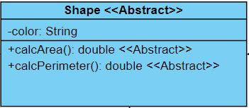

# 2.4 Class Diagram

## 1. What is Class Diagram

If there are only two classes in a system, it is not a problem for you to describe it in words. It won't be complicated to write and difficult for others to read. However, if your project contains a big hierarchy with 6 or 7 classes, and others classes outside the hierarchy, plus interfaces related to the project, then using sentences to describe the relationships between them would be a terrible idea, not only it will take time to write it, it would also be very difficult to read and understand.

`Unified Modeling Language (UML)` is in this case a standardized tool kit to visualize the design of a system. UML contains different diagrams to visualize the system from different views, in which, `Class Diagram` is a structural diagram that is used to indicates the relationship between classes, interfaces, packages etc. in the system.

The most famous application for UML development is MS visio. However, you can also find many free application online for simple UML development, such as [visual-paradigm](https://online.visual-paradigm.com/).

When developing a system, you should always first develop the UML, and then write the code based on it.

## 2. Symbols for Class Diagram

A class diagram contains two part, materials such as class or interface, and relationships

### 2.1 Material

#### 2.1.1 Class

A class can contains three parts:

1. Class name: in the first row, the class name is described, camel case. If the class is abstract, use `<<abstract>>` to indicate it

2. Data members and static variables: in the second part, all data members and static variables are listed. You have to pay attention to:

   1. Access modifier:
      * `public`: `+`
      * `private`: `-`
      * `protected`: `#`
      * `default`: `~`
   2. data type: different from Java syntax, the data type is defined after the variable name
   3. `static`: if a variable or a method is static, it should be noticed with **underline**. 

3. Methods: in the third part, all important methods are listed. You have to pay attention to:

   1. Only add important methods: Not all methods should be added to the class diagram, methods like constructors, equals(), hashcode(), toString(), getters and setters should not be added to the diagram, those methods will not bring any information to the class diagram since every class should have them, and they will make the class diagram super long and difficult to read.
   2. return type: the return type should also be written after the method name
   3. parameters: if a method requires parameters, then for each parameter, the data type should also be after the parameter name.
   4. abstract and override: if a method is abstract or override, use `<<abstract>>`  or `<<override>>` to indicate.

#### 2.1.2 Interface

An interface looks very similar to a class, the only difference is it is indicated with `<<Interface>>` in the first row

### 2.2 Relationship

### 2.2.1 Inheritance

If a class extends from another class, then the there is a solid line triangle arrow pointing from the subclass to the superclass.

### 2.2.2 Implementation

If a class implements an interface, then there is a dashed line triangle arrow pointing from the class to the interface

### 2.2.3  Association, Aggregation and Composition

Previous relationships relates to inheritance, however, two classes not necessary in the same hierarchy can still have some relationship between.

1. `Association`: If class A uses class B while class B also use class A, then the relationship between them are `association`. For example: Teacher class and Student class. You can use a solid line to link the two classes.

   

2. `Aggregation`: If class A uses class B while class B does not use class A, and class B can exist without class A. For example: Person class and Coat class. There should be an empty diamond arrow pointing from class B to class A.

   

3. `Composition`: If class A uses class B while class B does not use class A, and class B cannot exist without class A. For example: Person class and Hand class. There should be an filled diamond arrow pointing from class B to class A.

   